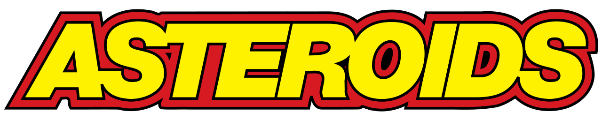

    
<a href="#">
    <h3>A Retro Classic in Virtual Reality!</h3>
    

    

## About
Virtual Reality project to make the retro space-themed game [Asteroids](https://en.wikipedia.org/wiki/Asteroids_(video_game)) into a Virtual Reality shootout against space rocks and aliens.

## References
* [Unity 2022.3.Xf1](https://unity.com/releases/editor/archive)
* [Universal Render Pipeline v14.0](https://docs.unity3d.com/Packages/com.unity.render-pipelines.universal@14.0/manual/index.html)